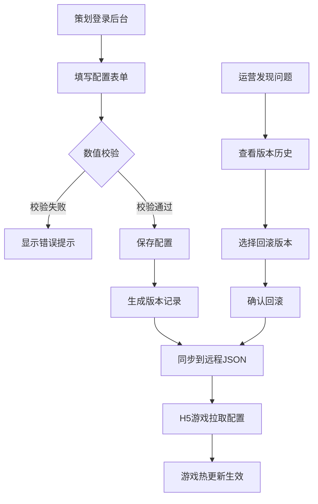

# 三消小游戏全栈运营配置系统 - 产品需求文档

## 1. 产品概述

独立工作室自研H5三消小游戏的全栈运营配置系统，解决Excel配置导致的数值BUG和热更新问题。通过可视化后台配置游戏数据，服务端二次校验，实现活动热更新和数据安全。

- 核心问题：Excel手动配置易出错，活动上线需重新部署，玩家可篡改本地数据
- 目标用户：策划、运营、开发人员
- 产品价值：降低配置错误率90%，活动上线时间从小时级缩短到分钟级

## 2. 核心功能

### 2.1 用户角色

| 角色 | 登录方式 | 核心权限 |
|------|----------|----------|
| 超级管理员 | 账号密码 | 所有权限，用户管理，系统配置 |
| 策划 | 账号密码 | 关卡配置，道具配置，活动配置，数值配置，数据查看 |
| 运营 | 账号密码 | 活动启停，奖励补发，数据报表查看 |

### 2.2 功能模块

1. **运营后台 - 登录页**：账号登录，权限验证
2. **运营后台 - 仪表盘**：数据概览，核心指标图表
3. **运营后台 - 关卡管理**：关卡列表，关卡配置，掉落配置，数值校验
4. **运营后台 - 道具商城**：道具列表，价格配置，库存管理
5. **运营后台 - 签到系统**：签到规则配置，签到奖励配置
6. **运营后台 - 活动管理**：活动列表，活动配置，活动启停，限时节日活动
7. **运营后台 - 玩家管理**：玩家列表，定向补发，补发记录
8. **运营后台 - 配置版本**：版本列表，版本对比，一键回滚
9. **运营后台 - 数据报表**：留存分析，道具消耗，广告收益
10. **H5游戏客户端**：三消游戏核心，配置拉取，奖励领取，关卡结算
11. **Node服务端**：配置API，数据校验，活动控制，补发服务，数据统计

### 2.3 页面详情

| 页面名称 | 模块名称 | 功能描述 |
|----------|----------|----------|
| 登录页 | 登录表单 | 账号密码登录，验证码，记住登录状态 |
| 仪表盘 | 数据概览 | DAU、留存率、在线人数、充值金额核心指标 |
| 仪表盘 | 图表展示 | 7日留存趋势、道具消耗排行、广告收益趋势 |
| 关卡管理 | 关卡列表 | 关卡搜索、分页、启用/禁用、快速编辑 |
| 关卡管理 | 关卡配置 | 目标分数、步数、障碍物、掉落概率、数值上限校验 |
| 关卡管理 | 掉落配置 | 道具掉落概率、单日全服产出封顶、稀有道具限制 |
| 道具商城 | 道具列表 | 道具分类、搜索、上下架、价格编辑 |
| 道具商城 | 道具配置 | 名称、图标、描述、价格、限购、库存 |
| 签到系统 | 签到规则 | 签到周期、连续签到奖励、补签规则 |
| 签到系统 | 奖励配置 | 每日奖励内容、特殊日额外奖励 |
| 活动管理 | 活动列表 | 活动搜索、状态筛选、启停操作 |
| 活动管理 | 活动配置 | 活动时间、参与条件、奖励规则、掉落配置 |
| 玩家管理 | 玩家列表 | 玩家搜索、玩家信息、道具背包查看 |
| 玩家管理 | 定向补发 | 输入玩家ID、选择礼包、补发原因、记录留存 |
| 配置版本 | 版本列表 | 版本号、创建时间、操作人、变更内容 |
| 配置版本 | 版本操作 | 版本对比、一键回滚、版本备注 |
| 数据报表 | 留存分析 | 次日/7日/30日留存、渠道对比 |
| 数据报表 | 道具消耗 | 道具消耗排行、每日消耗趋势 |
| 数据报表 | 广告收益 | 广告位收益、eCPM、展示次数 |

## 3. 核心流程

### 3.1 配置发布流程

策划在后台填写配置表单 → 系统进行数值校验（上限、概率总和、产出封顶）→ 校验通过保存配置 → 生成版本记录 → 配置自动同步到远程JSON → H5游戏启动时拉取最新配置 → 游戏运行使用新配置（热更新）

### 3.2 奖励领取流程

玩家在游戏中点击领取奖励 → 客户端发送请求到服务端 → 服务端校验活动有效性、玩家资格、奖励上限 → 校验通过发放奖励并记录 → 返回结果给客户端 → 客户端展示奖励动画

### 3.3 配置回滚流程

运营发现配置问题 → 在版本管理中查看历史版本 → 选择要回滚的版本 → 确认回滚操作 → 系统恢复配置数据 → 更新远程JSON → 新进入游戏的玩家使用回滚后的配置

## 4. 用户界面设计

### 4.1 设计风格

- **主色调**：深紫色 (#6C5CE7) - 代表创意与游戏感
- **辅助色**：珊瑚橙 (#FF7675) - 强调操作按钮
- **成功色**：薄荷绿 (#00B894) - 成功状态
- **警告色**：落日黄 (#FDCB6E) - 警告提示
- **错误色**：朱砂红 (#E17055) - 错误状态
- **中性色**：深灰 (#2D3436)、中灰 (#636E72)、浅灰 (#B2BEC3)、背景 (#FAFAFA)
- **按钮风格**：圆角矩形 (8px)，悬停有微动画，主按钮有渐变效果
- **字体**：标题使用 Poppins，正文使用 Inter，数字使用 Roboto Mono
- **布局风格**：卡片式布局，左侧导航栏 + 顶部工具栏 + 主内容区
- **图标风格**：线性图标，统一圆角，颜色与业务场景匹配

### 4.2 页面设计概览

| 页面名称 | 模块名称 | UI元素 |
|----------|----------|--------|
| 登录页 | 登录卡片 | 渐变背景、居中卡片、玻璃拟态效果、输入框浮动标签、登录按钮Loading动画 |
| 仪表盘 | 数据概览 | 数据卡片网格、数字滚动动画、彩色图标、趋势小图表 |
| 仪表盘 | 图表区域 | ECharts折线图/柱状图、卡片阴影、悬停交互、时间筛选器 |
| 关卡管理 | 列表页 | 表格设计、斑马纹、操作列按钮、状态标签、搜索过滤栏 |
| 关卡管理 | 配置表单 | 分组标签页、数值输入框带步进器、概率滑块、实时校验提示、保存按钮固定底部 |
| 活动管理 | 活动卡片 | 卡片网格、活动封面、状态角标、启停开关、快速操作按钮 |
| 配置版本 | 对比视图 | 双列对比、差异高亮、时间线展示、回滚确认弹窗 |
| 数据报表 | 报表页 | 标签页切换、图表联动、数据导出、条件筛选器 |

### 4.3 响应式设计

- **桌面优先**：针对1920x1080设计，适配1366x768及以上
- **平板适配**：导航栏可折叠，表格支持横向滚动
- **操作优化**：按钮最小44x44px，输入框有足够点击区域
- **H5游戏端**：针对手机屏幕优化，竖屏设计，触摸操作友好

### 4.4 动效设计

- **页面进入**：元素淡入 + 轻微上移动画，使用stagger延迟
- **按钮交互**：悬停时放大1.02倍，点击时缩小0.98倍，颜色渐变
- **表单校验**：错误提示滑入，输入框抖动动画
- **数据更新**：数字变化时滚动动画，新增行高亮闪烁
- **加载状态**：骨架屏过渡，Spinner旋转动画
