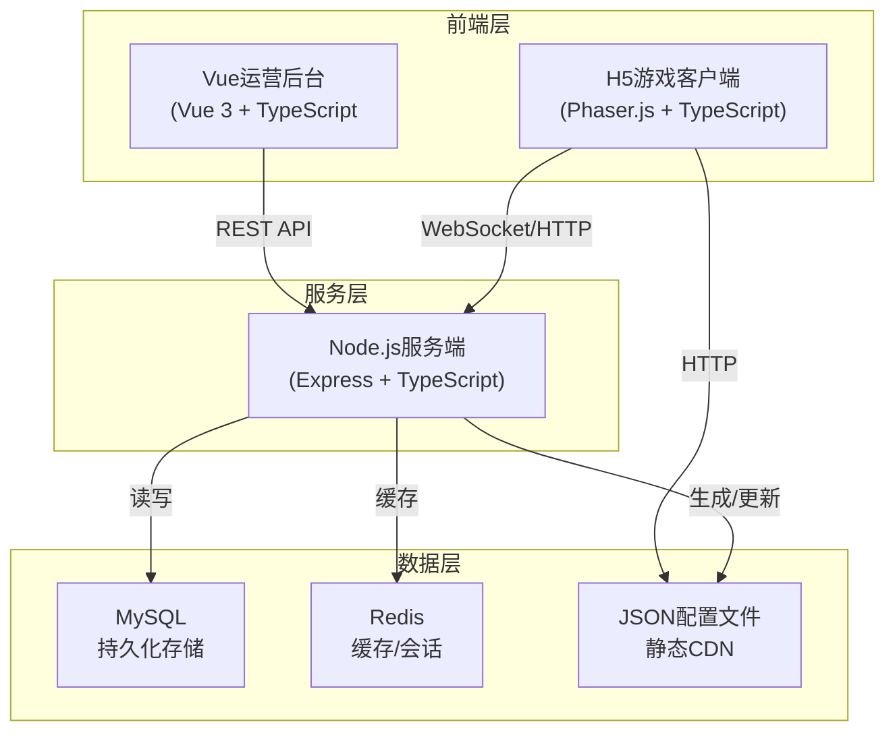
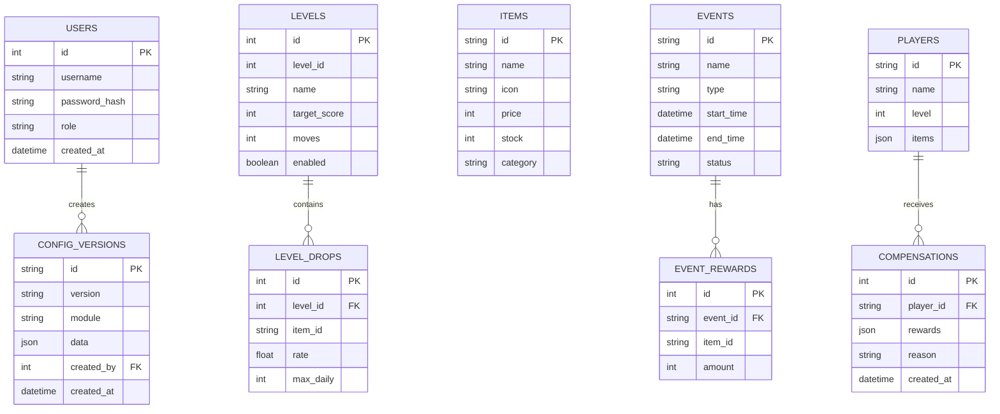

# 三消小游戏全栈运营配置系统 - 技术架构文档

## 1. 整体架构设计



## 2. 技术选型说明

### 2.1 技术栈总览

| 层级 | 技术选型 | 版本 | 说明 |
|------|----------|------|------|
| 运营后台 | Vue 3 | 3.4+ | Composition API + <script setup> |
| 运营后台UI | Element Plus | 2.4+ | 企业级组件库 |
| 运营后台构建 | Vite | 5.0+ | 快速构建工具 |
| 运营后台状态 | Pinia | 2.1+ | Vue官方状态管理 |
| 运营后台图表 | ECharts | 5.4+ | 数据可视化 |
| 运营后台路由 | Vue Router | 4.2+ | 路由管理 |
| 游戏客户端 | Phaser.js | 3.80+ | 2D游戏引擎 |
| 游戏构建 | Vite | 5.0+ | 游戏客户端构建 |
| 服务端 | Node.js | 20+ | LTS版本 |
| 服务端框架 | Express | 4.18+ | Web框架 |
| 服务端语言 | TypeScript | 5.3+ | 类型安全 |
| 数据库 | MySQL | 8.0+ | 关系型数据库 |
| 缓存 | Redis | 7.0+ | 缓存和会话存储 |
| ORM | Prisma | 5.8+ | 类型安全ORM |
| 认证 | JWT | 9.0+ | 身份认证 |
| 接口文档 | Swagger | 5.0+ | API文档 |

### 2.2 项目结构

```
match3-system/
├── admin/                 # Vue运营后台
│   ├── src/
│   │   ├── api/          # API接口
│   │   ├── components/   # 公共组件
│   │   ├── views/        # 页面视图
│   │   ├── stores/       # Pinia状态
│   │   ├── router/       # 路由配置
│   │   ├── utils/        # 工具函数
│   │   └── styles/       # 样式文件
│   └── package.json
├── server/               # Node服务端
│   ├── src/
│   │   ├── controllers/  # 控制器
│   │   ├── services/     # 业务逻辑
│   │   ├── models/       # 数据模型
│   │   ├── routes/       # 路由
│   │   ├── middleware/   # 中间件
│   │   ├── utils/        # 工具函数
│   │   └── config/       # 配置
│   ├── prisma/           # Prisma schema
│   └── package.json
├── game-client/          # H5游戏客户端
│   ├── src/
│   │   ├── scenes/       # Phaser场景
│   │   ├── objects/      # 游戏对象
│   │   ├── config/       # 配置管理
│   │   ├── utils/        # 工具函数
│   │   └── assets/       # 资源文件
│   └── package.json
└── config-json/          # 生成的配置JSON(CDN发布)
```

## 3. 路由定义

### 3.1 运营后台路由

| 路由路径 | 页面名称 | 说明 |
|----------|----------|------|
| /login | 登录页 | 用户登录 |
| /dashboard | 仪表盘 | 数据概览 |
| /levels | 关卡列表 | 关卡管理列表 |
| /levels/:id | 关卡配置 | 单个关卡配置 |
| /items | 道具商城 | 道具列表 |
| /items/:id | 道具配置 | 道具编辑 |
| /checkin | 签到配置 | 签到规则配置 |
| /events | 活动列表 | 活动管理 |
| /events/:id | 活动配置 | 活动编辑 |
| /players | 玩家列表 | 玩家管理 |
| /players/compensation | 定向补发 | 奖励补发 |
| /versions | 版本管理 | 配置版本 |
| /reports/retention | 留存报表 | 留存分析 |
| /reports/items | 道具消耗 | 道具消耗报表 |
| /reports/ads | 广告收益 | 广告收益报表 |

### 3.2 服务端API路由

| 路由前缀 | 模块 | 说明 |
|----------|------|------|
| /api/auth | 认证 | 登录、登出、权限 |
| /api/levels | 关卡 | CRUD、配置 |
| /api/items | 道具 | 道具管理 |
| /api/checkin | 签到 | 签到配置 |
| /api/events | 活动 | 活动管理 |
| /api/players | 玩家 | 玩家信息、补发 |
| /api/versions | 版本 | 版本管理、回滚 |
| /api/reports | 报表 | 数据报表 |
| /api/config | 配置 | JSON配置输出 |
| /api/game | 游戏 | 游戏接口 |

## 4. API接口定义

### 4.1 TypeScript类型定义

```typescript
// 通用响应
interface ApiResponse<T> {
  code: number;
  message: string;
  data: T;
}

interface PageResponse<T> {
  list: T[];
  total: number;
  page: number;
  pageSize: number;
}

// 用户
interface User {
  id: number;
  username: string;
  role: 'admin' | 'planner' | 'operator';
  createdAt: string;
}

// 关卡配置
interface LevelConfig {
  id: number;
  levelId: number;
  name: string;
  targetScore: number;
  moves: number;
  obstacles: string[];
  dropRates: DropRate[];
  dailyLimit: Record<string, number>;
  enabled: boolean;
}

interface DropRate {
  itemId: string;
  rate: number;
  maxDaily: number;
}

// 道具
interface Item {
  id: string;
  name: string;
  icon: string;
  description: string;
  price: number;
  category: string;
  stock: number;
  enabled: boolean;
}

// 活动
interface GameEvent {
  id: string;
  name: string;
  type: string;
  startTime: string;
  endTime: string;
  status: 'draft' | 'active' | 'ended';
  rewards: EventReward[];
  rules: Record<string, any>;
}

// 玩家
interface Player {
  id: string;
  name: string;
  level: number;
  items: Record<string, number>;
}

// 配置版本
interface ConfigVersion {
  id: string;
  version: string;
  module: string;
  createdAt: string;
  operator: string;
  changes: string[];
  data: Record<string, any>;
}
```

### 4.2 核心接口

#### 关卡配置
```
POST   /api/levels
GET    /api/levels
PUT    /api/levels/:id
DELETE /api/levels/:id
POST   /api/levels/:id/enable
```

#### 活动管理
```
POST   /api/events
GET    /api/events
PUT    /api/events/:id
POST   /api/events/:id/start
POST   /api/events/:id/stop
```

#### 配置版本
```
GET    /api/versions
GET    /api/versions/:id
POST   /api/versions/:id/rollback
GET    /api/versions/compare?from&to
```

#### 游戏客户端接口
```
GET    /api/config/all.json
POST   /api/game/reward/claim
POST   /api/game/level/complete
```

## 5. 服务端架构

```mermaid
graph LR
    A["客户端请求"] --> B["路由层<br/>Routes
    B --> C["中间件层<br/>Middleware"]
    C --> D["认证<br/>Auth"]
    C --> E["权限校验<br/>Permission"]
    C --> F["参数校验<br/>Validation"]
    F --> G["控制器层<br/>Controllers"]
    G --> H["服务层<br/>Services"]
    H --> I["业务逻辑<br/>Business Logic"]
    H --> J["数值校验<br/>Value Validation"]
    H --> K["数据访问层<br/>Repositories"]
    K --> L["Prisma ORM"]
    L --> M["MySQL数据库"]
    H --> N["Redis缓存"]
    G --> O["配置生成器<br/>Config Generator"]
    O --> P["JSON文件"]
```

### 5.1 目录结构

```
server/src/
├── controllers/
│   ├── auth.controller.ts
│   ├── level.controller.ts
│   ├── item.controller.ts
│   ├── event.controller.ts
│   ├── player.controller.ts
│   ├── version.controller.ts
│   └── report.controller.ts
├── services/
│   ├── auth.service.ts
│   ├── level.service.ts
│   ├── validation.service.ts
│   ├── config.service.ts
│   └── report.service.ts
├── middleware/
│   ├── auth.middleware.ts
│   ├── validation.middleware.ts
│   └── error.middleware.ts
├── routes/
│   ├── auth.routes.ts
│   └── index.ts
├── utils/
│   ├── errors.ts
│   └── helpers.ts
├── config/
│   └── config.ts
│   └── constants.ts
└── server.ts
```

## 6. 数据模型设计

### 6.1 ER图



### 6.2 数据表定义

```prisma
model User {
  id        Int      @id @default(autoincrement())
  username  String   @unique
  password  String
  role      String   @default("planner")
  createdAt DateTime @default(now())
}

model Level {
  id          Int      @id @default(autoincrement())
  levelId     Int      @unique
  name        String
  targetScore Int
  moves       Int
  obstacles   Json
  enabled     Boolean  @default(true)
  drops       LevelDrop[]
}

model LevelDrop {
  id        Int     @id @default(autoincrement())
  levelId   Int
  itemId    String
  rate      Float
  maxDaily  Int
  level     Level   @relation(fields: [levelId], references: [id])
}

model Item {
  id          String  @id
  name        String
  icon        String
  description String?
  price       Int
  stock       Int     @default(0)
  category    String
  enabled     Boolean @default(true)
}

model GameEvent {
  id        String   @id
  name      String
  type      String
  startTime DateTime
  endTime   DateTime
  status    String   @default("draft")
  rewards   Json
  rules     Json
  rewardsDetail EventReward[]
}

model EventReward {
  id      Int        @id @default(autoincrement())
  eventId String
  itemId  String
  amount  Int
  event   GameEvent  @relation(fields: [eventId], references: [id])
}

model Player {
  id      String @id
  name    String
  level   Int    @default(1)
  items   Json
}

model Compensation {
  id        Int      @id @default(autoincrement())
  playerId  String
  rewards   Json
  reason    String
  operator  String
  createdAt DateTime @default(now())
}

model ConfigVersion {
  id        String   @id
  version   String
  module    String
  data      Json
  operator  String
  createdAt DateTime @default(now())
}
```

## 7. 配置热更新机制

### 7.1 配置生成流程

1. 后台保存配置 → 2. 版本记录 → 3. JSON生成 → 4. CDN发布 → 5. 客户端拉取

### 7.2 客户端拉取策略

- 游戏启动时拉取 `config.json`
- 缓存本地，版本号对比
- 有新版本则更新
- 游戏中不更新不影响进行中的游戏

## 8. 数值校验机制

### 8.1 前端校验

- 实时表单校验
- 数值范围限制
- 概率总和校验
- 配置预览

### 8.2 服务端校验

- 配置保存时二次校验
- 稀有道具产出上限
- 活动时间冲突检测
- 配置版本记录

## 9. 部署方案

### 9.1 开发环境

- 本地开发：三个项目分别启动
- 数据库：本地MySQL + Redis

### 9.2 生产环境

- 运营后台：Nginx静态部署
- 服务端：PM2集群部署
- 游戏客户端：CDN部署
- 配置JSON：CDN加速
